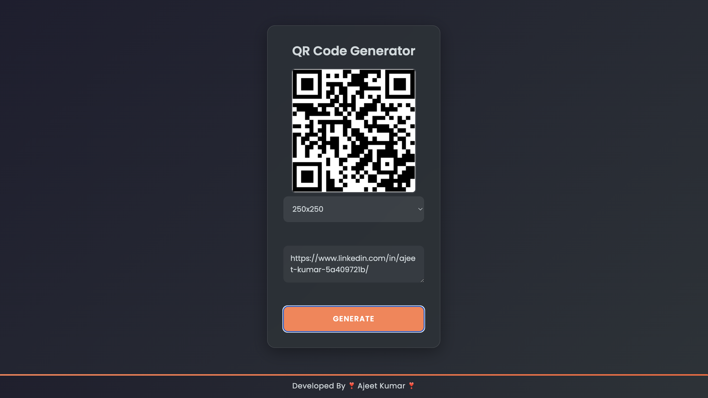

# ✨ QR Code Generator

A modern, glassmorphic-styled form card with minimal gaps, clean typography, and a gradient footer that stretches across the entire viewport. Built with pure HTML and CSS.

---

## 🚀 Live Demo

[](https://qr-code-generator-ajeet.netlify.app/)

---

## 📸 Preview



---

## 📌 Features

- 📐 Glassmorphic card design
- 🎨 Smooth gradient background
- 💾 Custom Google font integration
- 🔥 Full-width footer with gradient top border
- ✨ Subtle glow and hover animations
- 📱 Fully responsive

---

## 📦 Technologies Used

- **HTML5**
- **CSS3** (Flexbox, Grid, Google Fonts, Linear Gradients)

---

## 📃 How to Use

1. **Clone the repository**
   ```bash
   git clone https://github.com/yourusername/your-repo-name.git
